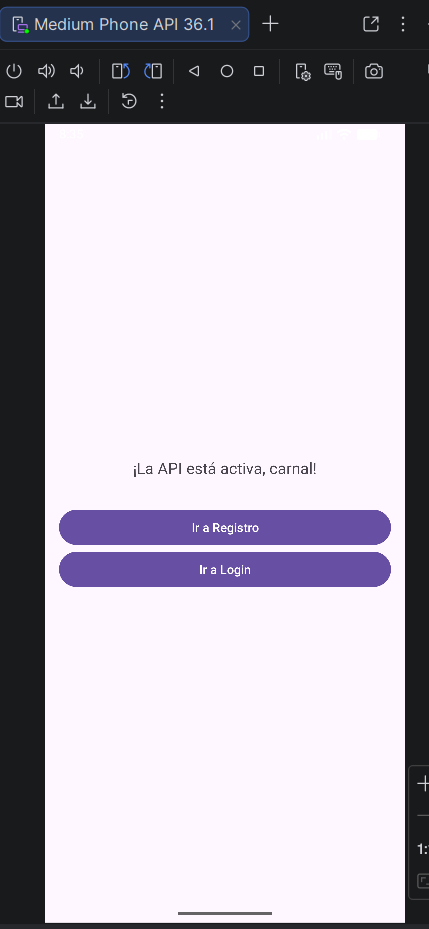
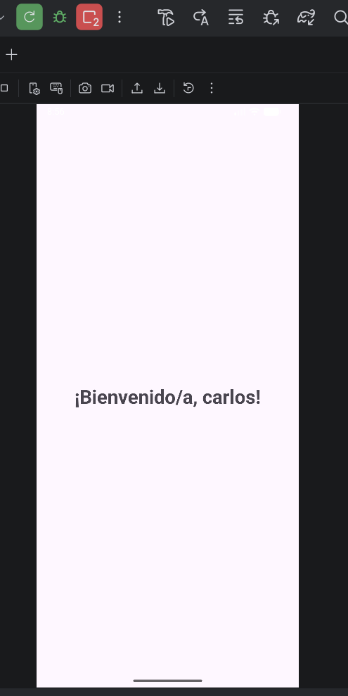
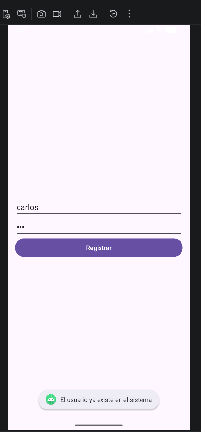
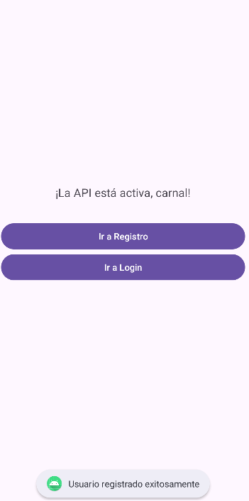
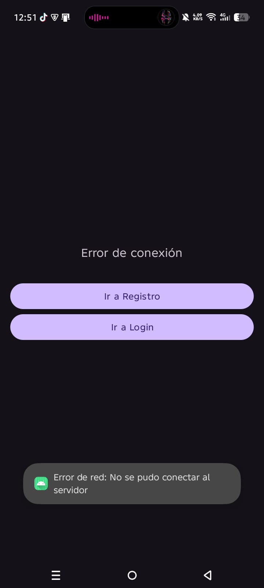

#  Tarea 3: Backend de la Práctica 2 (Android + API REST)

**Autor:** Kevin Zarco Sosa  
**Institución:** Escuela Superior de Cómputo (ESCOM - IPN)  

##  Explicación del Desarrollo del Backend

El backend fue diseñado como una **API RESTful** utilizando el micro-framework **Flask**. La arquitectura se centra en la persistencia de datos y la seguridad de los mismos. A continuación, se detallan los puntos clave de su construcción:

1. **Gestión de Base de Datos:** Se implementó **SQLAlchemy** (ORM) para interactuar con una base de datos **SQLite**. Esto permite manejar los usuarios como objetos de Python, facilitando las consultas y el registro sin necesidad de escribir SQL puro.
2. **Seguridad de Credenciales:** Para cumplir con los estándares de seguridad, las contraseñas no se guardan en texto plano. Se utilizó la librería **Bcrypt** para generar un *hash* único y salado antes de almacenar la información en la base de datos.
3. **Endpoints Implementados:**
   * `GET /`: Endpoint de salud para verificar la disponibilidad del servicio.
   * `POST /register`: Recibe un JSON, verifica que el usuario no exista y persiste los datos.
   * `POST /login`: Compara el hash de la base de datos con la contraseña proporcionada mediante `check_password_hash`.
4. **Contenerización:** Se creó un **Dockerfile** basado en `python:3.9-slim` para minimizar el peso de la imagen y un archivo `docker-compose.yml` para gestionar los volúmenes de datos, asegurando que la base de datos sea persistente aunque el contenedor se detenga.

---


##  Stack Tecnológico

| Entorno | Tecnologías Utilizadas |
| :--- | :--- |
| **Backend** | Python 3.9, Flask, SQLAlchemy, Bcrypt, SQLite |
| **Infraestructura** | Docker, Docker Compose |
| **Frontend (Móvil)** | Android Studio (Kotlin/Java), XML, ViewBinding |
| **Cliente HTTP** | Retrofit 2, Gson |

---

##  Guía de Despliegue del Backend

El servidor expone el puerto `5000` y cuenta con tres endpoints principales (`GET /`, `POST /register`, `POST /login`). Para iniciarlo, sigue estos pasos:

1. Asegúrate de tener el motor de **Docker Desktop** ejecutándose en tu sistema.
2. Abre una terminal y sitúate en la raíz del directorio del backend (donde está el archivo `docker-compose.yml`).
3. Ejecuta el orquestador de contenedores con el siguiente comando:
   ```bash
   docker compose up --build
 4-.El servidor estará activo y escuchando peticiones en http://localhost:5000.
 
---

##  Compilación de la Aplicación Android

Para probar la aplicación cliente, es necesario configurar correctamente la red dependiendo del entorno de pruebas:

1. Abre el proyecto Android usando **Android Studio**.
2. Espera a que Gradle sincronice todas las dependencias.
3. Verifica la URL base en la configuración de Retrofit:
   * *Para el Emulador de Android Studio:* Usa la dirección `http://10.0.2.2:5000/`.
   * *Para un celular físico:* Cambia la dirección por la IP de tu red local (ejemplo: `http://192.168.1.75:5000/`).
4. Haz clic en **Run 'app'** (Shift + F10) para compilar e instalar la aplicación.

---

##  Ejercicios (Capturas de Pantalla)

A continuación, se documenta el correcto funcionamiento de los 4 ejercicios solicitados en la práctica:

###  Ejercicio 1: Estado del Servidor
Demostración de la conexión exitosa al iniciar la app. Petición GET al endpoint `/`.

<details>
  <summary> Click para ver captura</summary>
  
</details>

###  Ejercicio 2: Flujo de Registro de Usuarios
Validación de la creación de un usuario en la base de datos y manejo de restricciones. Petición POST a `/register`.

<details>
  <summary> Click para ver Registro Exitoso</summary>
  
</details>

<details>
  <summary> Click para ver Error Usuario Duplicado</summary>
  
</details>

###  Ejercicio 3: Autenticación (Login)
Comprobación de credenciales y redirección de vistas. Petición POST a `/login`.

<details>
  <summary> Click para ver Login Exitoso</summary>
  
</details>

###  Ejercicio 4: Tolerancia a Fallos de Red
Manejo de excepciones en Retrofit. Se simuló la caída del servidor deteniendo el contenedor de Docker.

<details>
  <summary> Click para ver Error de Red</summary>
  
</details>
